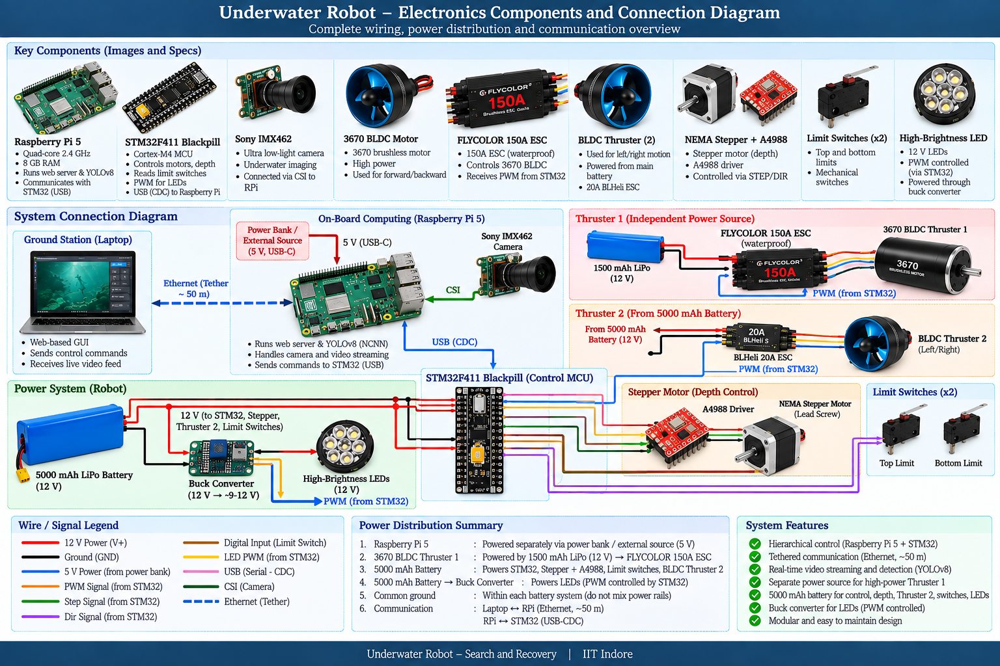
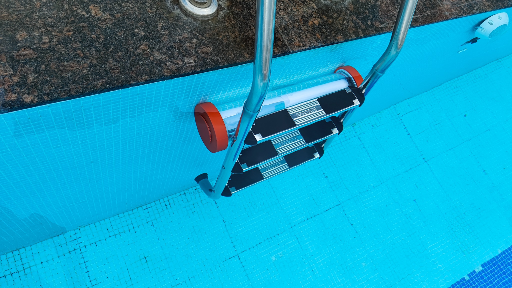
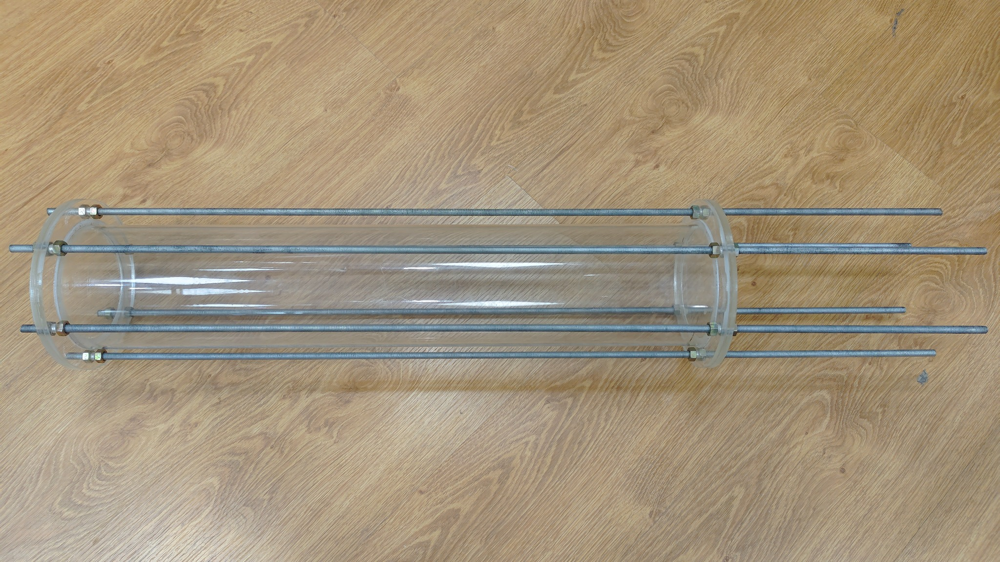

# Underwater Search & Rescue ROV

> **A tethered underwater robotic platform for search, visual inspection, and assisted recovery in low-visibility environments.**

A multidisciplinary prototype integrating **mechanical design, embedded control, underwater propulsion, variable buoyancy, live video, and computer vision**. The current BTP cycle focuses on improving the reliability of the earlier platform and addressing the mechanical sealing and system-level thermal limitations identified during testing.

---

## Overview

Underwater search and recovery is challenging because of light attenuation, turbidity, hydrostatic pressure, and limited visibility. The project develops a compact ROV that keeps the operator in the loop while providing controlled underwater motion, live video, and machine-learning-assisted detection.

The system uses a **Raspberry Pi 5** for high-level communication, video handling and software, while an **STM32F4 BlackPill** handles timing-sensitive actuator control.


---

## Key Features

- Tethered operator-controlled ROV
- Raspberry Pi 5 + STM32F4 dual-controller architecture
- Twin BLDC thrusters with ESC-based control
- Lead-screw / syringe mechanism for depth control
- On-board low-light camera
- Web-based control and live video interface
- YOLOv8-based lightweight detection pipeline
- Iterative mechanical sealing and underwater validation
- Modular construction for further field testing

---

## System Architecture

The operator communicates with the robot through a tethered ground station. The Raspberry Pi handles high-level communication, camera streaming and software, while the STM32 provides real-time actuator control.



The communication architecture separates high-level processing from timing-sensitive actuator control.


---

# Mechanical Design Evolution

The mechanical system went through **three major stages: Prototype 0, Iteration 1, and Iteration 2**. The progression was driven by physical testing rather than only CAD refinement.

The key engineering problem was waterproofing the acrylic enclosure under submerged conditions.

## Prototype 0 — Initial Threaded-Cap Design

The **red/blue threaded-cap assembly** was the initial mechanical prototype. It used 3D-printed end-cap components and a threaded sealing arrangement around the acrylic tube.

During submerged testing, water ingress was observed around the sealing/interface region. The test exposed the limitations of relying on a 3D-printed threaded interface for a pressure-resistant underwater enclosure.


The Prototype 0 failure established the main mechanical requirement for the following designs: the enclosure needed a more uniform and repeatable compression-based seal.

---

## Iteration 1 — Intermediate Mechanical Redesign

Following the Prototype 0 failure, the mechanical design was revised and fabricated as an intermediate configuration. This stage was used to improve the enclosure geometry, component arrangement, and mechanical integration before moving to the final compression-based sealing concept.



The lessons from this stage were used to move away from relying on printed threaded interfaces and toward a distributed mechanical clamping mechanism.

> **Design lesson:** underwater sealing was treated as a system-level mechanical problem rather than a problem that could be solved simply by adding more sealant to a threaded joint.

---

## Iteration 2 — Through-Rod Compression Seal

The final mechanical redesign replaced the threaded sealing approach with a **flat-face compression gasket**.

The design uses:

- 8 mm laser-cut circular acrylic end plates
- Custom two-part silicone gasket
- Machined gasket seating surfaces
- Polished acrylic tube edges
- Six M8 threaded steel through-rods
- Nuts/wedges to apply distributed clamping force



Unlike the previous threaded design, the sealing force is distributed across the complete end-plate interface.

### Validation

The Iteration 2 enclosure was submerged for **more than 12 minutes continuously with zero observed water ingress** in the reported test.

This provided the first successful validation of the redesigned compression-sealing concept.


---

## Final Mechanical Integration

The final Fusion 360 assembly combines the enclosure, internal structural elements, propulsion arrangement, and depth-control mechanism.


The retained depth-control mechanism uses a lead screw to move the buoyancy-control assembly.


The resulting platform was then taken through pool-level mechanical and propulsion testing.

---

# Electronics & Control

The electronics use a hierarchical architecture:

| Subsystem | Hardware | Main role |
|---|---|---|
| Ground station | Laptop | Operator interface and external ML processing |
| High-level controller | Raspberry Pi 5 | Communication, camera and software |
| Real-time controller | STM32F4 BlackPill | PWM, motor and actuator control |
| Propulsion | BLDC motors + ESCs | Forward/lateral movement |
| Depth control | Stepper + lead screw | Controlled depth adjustment |
| Vision | Low-light camera | Live underwater video |

The electronics and control architecture were retained from the earlier prototype while the current work concentrated on mechanical reliability and system-level improvements.

---

# Compute & Vision Architecture

The earlier system attempted to execute the detection pipeline directly on the sealed Raspberry Pi. Testing showed that the resulting thermal load was unsuitable for prolonged operation inside the enclosure.

The current architecture therefore moves heavy inference toward the ground station:

```text
Underwater Camera
       │
       ▼
 Raspberry Pi
       │
       │ Ethernet tether
       ▼
 Ground-Station PC
       │
       ▼
 YOLOv8 / NCNN
       │
       ▼
 Detection + Live Video
```

This reduces the computational and thermal burden inside the sealed robot while retaining live visual feedback.

---

# Current Status

**Prototype integration and validation stage**

- Prototype 0 failure identified through submerged testing
- Iteration 1 developed as an intermediate mechanical redesign
- Iteration 2 compression enclosure fabricated
- Zero observed water ingress for >12 minutes in the reported submerged test
- STM32 + Raspberry Pi control architecture re-established
- Stepper / lead-screw depth mechanism bench-tested
- Web-based control interface operational
- Camera and video pipeline integrated
- Ground-station ML offload architecture established
- Pool-level mechanical/propulsion testing performed

The remaining work is focused on complete system integration, feedthrough sealing, internal/external mounting, buoyancy balancing and longer-duration end-to-end testing.

---

# Next Steps

- Seal and validate Ethernet, motor and syringe feedthroughs
- Finalize internal and external component mounts
- Complete ground-station YOLO processing pipeline
- Finalize dedicated Raspberry Pi power delivery
- Balance the center of gravity and buoyancy
- Perform extended tests in turbid water
- Evaluate long-duration thermal and waterproofing performance

---

## Repository Structure

```text
Underwater_ROV/
├── mechanical/
│   ├── iteration_1/
│   ├── iteration_2/
│   └── README.md
├── schematics/
│   ├── schematics_and_components.pdf
│   ├── hand_drawn_electrical_wiring.png
│   ├── overall_system_connection_diagram.png
│   └── communication_connection_flow.png
├── firmware/
│   └── stm32/
├── software/
│   └── raspberry_pi/
├── scripts/
├── README.md
├── LICENSE
└── CHANGELOG.md
```

---

## Technology Stack

**Embedded:** STM32F4 · STM32CubeIDE · C · PWM · GPIO  
**Compute:** Raspberry Pi 5 · Python · NCNN  
**Vision:** YOLOv8n · OpenCV · Camera  
**Mechanical:** Fusion 360 · Acrylic · 3D Printing · Laser-cut acrylic  
**Propulsion:** BLDC motors · ESCs · Stepper motor  
**Communication:** Ethernet tether · USB CDC

---

## Project Context

**B.Tech Project — Electrical Engineering, IIT Indore**

The project combines mechanical engineering, embedded systems, electronics, communication, and computer vision to develop a practical underwater search-and-rescue platform.

---

## License

See [`LICENSE`](LICENSE) for licensing information.
