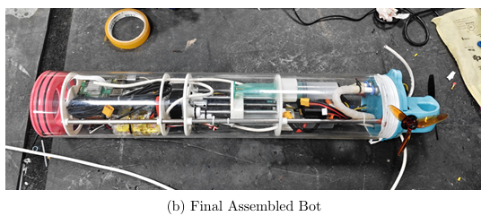
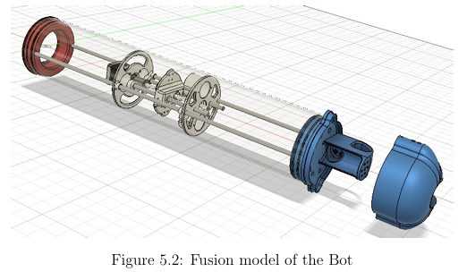

# Underwater Search & Rescue ROV

> **A tethered underwater robotic platform for search, visual inspection, and assisted recovery in low-visibility environments.**

A multidisciplinary BTP project integrating **mechanical design, underwater propulsion, embedded control, variable-buoyancy depth control, live video, communication, and computer vision**. The project is being developed as a practical, modular ROV rather than as a purely software or laboratory demonstrator.

---

## 1. Project Overview

Underwater search and recovery is difficult because visibility is degraded by turbidity and light attenuation, while hydrostatic pressure makes enclosure design a critical engineering constraint. Manual diving also exposes operators to the same environment being investigated.

The robot therefore follows a **tethered ROV architecture**:

- the operator remains at the surface;
- a laptop provides the ground-station interface;
- an Ethernet tether provides the communication path;
- a Raspberry Pi handles high-level onboard computing and communication;
- an STM32F4 handles timing-sensitive actuator control;
- BLDC thrusters provide horizontal movement;
- a lead-screw/syringe mechanism provides depth control;
- a low-light camera provides visual feedback.

The current BTP cycle is particularly focused on **mechanical reliability, waterproofing, thermal management, power distribution, and system-level integration**.

---

## 2. System-Level Flow

The complete operating flow can be viewed as five layers:

```text
                ┌─────────────────────────┐
                │      OPERATOR / PC      │
                │  Web UI + Video + ML    │
                └────────────┬────────────┘
                             │
                     Ethernet Tether
                             │
                ┌────────────▼────────────┐
                │      RASPBERRY PI 5     │
                │ Communication / Camera  │
                │ High-level coordination │
                └────────────┬────────────┘
                             │ USB CDC
                             │
                ┌────────────▼────────────┐
                │      STM32F411          │
                │ Real-time control layer │
                └──────┬──────┬──────┬────┘
                       │      │      │
                      PWM   STEP/   LIMIT
                       │     DIR    INPUT
                       ▼      ▼      ▼
                  BLDC ESC  Stepper  Switches
                       │      │
                       ▼      ▼
                  Thrusters  Lead Screw
```

The communication architecture separates **high-level computing** from **real-time actuator control**. This is important because camera/video processing and web communication do not need to run in the same timing-critical loop as motor-control signals.


---

# 3. Electronics Architecture

## 3.1 Ground Station

The ground station is a laptop connected to the robot through an approximately **50 m Ethernet tether**.

The laptop provides:

- operator control interface;
- command generation;
- live video monitoring;
- external processing when the ML workload is offloaded from the robot.

The tethered architecture avoids depending on underwater wireless communication and provides a direct communication link between the surface operator and the robot.

---

## 3.2 Raspberry Pi 5

The Raspberry Pi 5 is the **high-level computing and communication controller**.

Its responsibilities include:

- running the web server;
- receiving operator commands;
- handling communication with the STM32;
- receiving the camera stream;
- coordinating high-level robot behaviour;
- acting as the interface between the embedded controller and the ground station.

The camera is connected to the Raspberry Pi through its CSI interface.

### Why Raspberry Pi + STM32?

A single controller could theoretically handle the complete system, but separating the layers makes the architecture cleaner:

```text
Raspberry Pi
    │
    ├── Web interface
    ├── Camera
    ├── Communication
    └── High-level processing
            │
            ▼
         STM32
            │
            ├── PWM
            ├── Stepper control
            └── Limit switches
```

The STM32 therefore remains responsible for deterministic hardware control while the Raspberry Pi handles higher-level software.

---

## 3.3 STM32F411 BlackPill

The STM32F411 BlackPill is the **real-time actuator controller**.

It receives commands from the Raspberry Pi through **USB CDC** and converts them into hardware-level signals.

The controller handles:

- BLDC ESC PWM commands;
- stepper motor STEP/DIR signals;
- limit-switch inputs;
- LED control;
- actuator sequencing and low-level safety logic.

This division prevents the timing-sensitive motor-control layer from being tightly coupled to the operating-system workload on the Raspberry Pi.

---

# 4. Propulsion System

The ROV uses **BLDC thrusters driven through ESCs**.

The main propulsion path is:

```text
Control Command
      │
      ▼
 Raspberry Pi
      │ USB CDC
      ▼
   STM32F411
      │
      │ PWM
      ▼
     ESC
      │
      ▼
   BLDC Motor
      │
      ▼
    Thrust
```

The system uses differential thrust for horizontal movement. Changing the relative command to the left and right thrusters allows the robot to generate directional motion.

### ESC control

The STM32 does not directly drive the high-current BLDC motors. Instead, it generates the appropriate control signal for the ESCs.

This keeps the high-current switching stage electrically separated from the microcontroller.

---

# 5. Depth-Control Mechanism

Depth is controlled separately from horizontal propulsion using a **stepper motor and lead-screw mechanism connected to the syringe-based variable-buoyancy system**.

The control chain is:

```text
Depth Command
     │
     ▼
 Raspberry Pi
     │
     ▼
   STM32
     │
  STEP/DIR
     │
     ▼
   A4988
     │
     ▼
 Stepper Motor
     │
     ▼
 Lead Screw
     │
     ▼
 Syringe / Buoyancy Mechanism
     │
     ▼
 Change in Buoyancy
     │
     ▼
 Controlled Depth
```

The lead screw converts rotary motion from the stepper motor into controlled linear displacement.

This mechanism forms the third degree of freedom of the retained control architecture:

- **Forward / backward** — propulsion
- **Left / right** — differential thrust
- **Depth** — lead-screw buoyancy mechanism

---

# 6. Limit-Switch System

Two limit switches are incorporated into the depth mechanism.

```text
              Lead Screw Travel
       ┌──────────────────────────┐
       │                          │
  Top Limit                   Bottom Limit
       │                          │
       └────────── STM32 ─────────┘
```

The switches provide physical travel limits to prevent the depth mechanism from being driven beyond its intended range.

The STM32 reads these switches as digital inputs and can stop or constrain the stepper motion when a mechanical limit is reached.

---

# 7. Power Architecture

The power system is intentionally divided because the propulsion loads are significantly higher than the computing load.

### Main power paths

```text
                5000 mAh LiPo
                     │
          ┌──────────┼───────────┐
          │          │           │
          ▼          ▼           ▼
       STM32      Stepper      BLDC/ESC
          │          │           │
          │        A4988       Thruster
          │
          └── Buck Converter
                    │
                    ▼
                 12 V LED
```

The first high-power thruster uses a separate battery/ESC path in the documented electronics architecture.

The Raspberry Pi is supplied separately through a **5 V USB-C power source**, rather than placing its high computational load directly on the same low-voltage regulation path used by the control electronics.

A common ground is maintained between the relevant control electronics so that PWM, USB/serial and other control signals have a defined reference.

---

# 8. Lighting and Camera

Underwater visibility can degrade rapidly with depth and turbidity. The robot therefore uses a low-light camera together with high-brightness LEDs.

```text
Camera ───────────────► Raspberry Pi
                           │
                           ▼
                       Video Feed

STM32 ── PWM ──► LED Driver / Supply ──► High-brightness LEDs
```

The lighting system is controlled independently so that illumination can be adjusted without interfering with the camera data path.

---

# 9. Computer Vision Flow

The original prototype demonstrated an embedded YOLOv8/NCNN pipeline. However, testing exposed a system-level limitation: executing heavy ML inference inside a sealed enclosure added significant heat to the Raspberry Pi.

The current BTP architecture therefore investigates **offloading heavy inference to the ground-station PC**.

### Current intended flow

```text
Underwater Camera
       │
       ▼
 Raspberry Pi
       │
       │ Ethernet tether
       ▼
 Ground-Station PC
       │
       ▼
 YOLO Detection
       │
       ▼
 Operator Display
```

This architectural change reduces the computational and thermal burden inside the sealed robot while preserving the live-video workflow.

The earlier implementation achieved approximately **12 FPS using YOLOv8n converted to NCNN**; the present work is focused on improving the deployment architecture around the vision pipeline.

---

# 10. Mechanical Design Evolution

The mechanical development is documented as a progression from the **initial Prototype 0** through **Iteration 1** and **Iteration 2**.

The key design problem was not simply making an enclosure that looked sealed on the bench. The enclosure had to maintain its sealing performance when subjected to external water pressure during submersion.

---

## 10.1 Prototype 0 — Initial Red/Blue Cap Design

The red-and-blue capped robot shown below represents the **initial Prototype 0**, not the later Iteration 2 design.



Prototype 0 used a cylindrical acrylic body with 3D-printed end-cap structures and the initial internal mechanical arrangement.

Pool testing exposed the main weakness of the enclosure: **water ingress at the end-cap/tube sealing region**.


### Why Prototype 0 failed

The earlier enclosure relied heavily on 3D-printed sealing surfaces. The mid-semester failure analysis identified:

- leakage through the printed/infill region;
- leakage around the end-cap/acrylic interface;
- insufficiently uniform compression of the sealing interface;
- dimensional and layer-level irregularities associated with printed sealing surfaces.

The important observation was that the enclosure could appear acceptable in a simple bench/internal water test but still fail when exposed to **external pressure during actual submersion**.

This established the primary mechanical requirement for the subsequent redesigns:

> **The sealing force had to be distributed uniformly across a continuous sealing surface instead of relying on printed threads or local contact.**

---

## 10.2 Iteration 1 — Intermediate Mechanical Design

Iteration 1 was developed after the Prototype 0 failure as an intermediate mechanical redesign.

The purpose of this stage was to improve the enclosure arrangement and sealing approach while evaluating the mechanical changes through fabrication and underwater testing.

The design process at this stage was driven by the same failure mechanism identified in Prototype 0: a pressure-resistant underwater enclosure cannot depend solely on the dimensional accuracy of a 3D-printed sealing interface.

**Iteration 1 therefore served as the transition between the original cap-based enclosure and the final compression-based concept.**

The detailed fabrication photographs and CAD files for this stage are retained under:

```text
mechanical/
└── iteration_1/
```

---

## 10.3 Iteration 2 — Through-Rod Compression Design

Iteration 2 changed the sealing principle completely.

Instead of using threaded 3D-printed caps, the design uses a **flat-face compression gasket**. The acrylic tube is clamped between two larger end plates, with the sealing force distributed through multiple longitudinal rods.

The documented design uses:

- **8 mm circular acrylic end plates**
- a custom **two-part silicone gasket**
- machined gasket seating regions
- polished acrylic tube edges
- **six M8 threaded steel through-rods**
- nuts/wedges to generate distributed clamping force


The mechanical principle is:

```text
      End Plate                         End Plate
          │                                │
          ▼                                ▼
      ┌───────┐      Acrylic Tube      ┌───────┐
      │ Gasket│=========================│Gasket │
      └───────┘                         └───────┘
          ▲                                ▲
          └────── M8 Through-Rods ────────┘
                    │
                    ▼
             Distributed Clamp
```

The six through-rods apply the clamping force across the complete end-plate assembly rather than concentrating the sealing action around a printed thread.

### Iteration 2 validation

The reported submerged test showed **zero observed water ingress for more than 12 minutes of continuous submersion**.

This was the key successful mechanical result of the current BTP cycle.



---

# 11. Mechanical Depth-Control Assembly

The lead-screw mechanism is retained across the mechanical development because it provides controlled linear movement for the syringe-based buoyancy system.


The mechanism consists of:

```text
Stepper Motor
     │
     ▼
 Lead Screw
     │
     ▼
 Linear Moving Element
     │
     ▼
 Syringe / Buoyancy Adjustment
```

The design allows the robot to control its vertical position without requiring a dedicated vertical thruster.

---

# 12. Complete Control Flow

Putting the electrical, mechanical and software layers together:

```text
                    OPERATOR
                       │
                       ▼
                Ground-Station PC
                Web UI / Video / ML
                       │
                 Ethernet Tether
                       │
                       ▼
                 Raspberry Pi 5
              ┌────────┼─────────┐
              │        │         │
           Camera   Commands   Video
              │        │         │
              └────────┼─────────┘
                       │
                    USB CDC
                       │
                       ▼
                  STM32F411
          ┌────────────┼────────────┐
          │            │            │
         PWM        STEP/DIR     Limit Inputs
          │            │            │
          ▼            ▼            ▼
        ESCs         A4988      Safety Limits
          │            │
          ▼            ▼
      BLDC Thruster  Stepper
                       │
                       ▼
                   Lead Screw
                       │
                       ▼
                 Buoyancy / Depth
```

This architecture separates the system into three practical levels:

1. **Human level** — operator commands and monitoring.
2. **Computing level** — Raspberry Pi and ground-station processing.
3. **Control level** — STM32 and physical actuators.

---

# 13. Current Project Status

The project is currently in the **prototype integration and validation stage**.

### Demonstrated / completed

- Initial mechanical failure identified through underwater testing
- Mechanical redesign process carried through multiple prototypes
- Iteration 2 compression enclosure fabricated
- More than 12 minutes of submerged testing with zero observed water ingress for the Iteration 2 enclosure
- Raspberry Pi + STM32 control architecture re-established
- Stepper/lead-screw mechanism bench-tested
- Web-based control interface established
- Camera/video pipeline established
- Ground-station ML-offload architecture defined and being integrated
- Pool-level mechanical testing performed

### Remaining integration work

- Final feedthrough sealing
- Internal and external component mounting
- Complete power-delivery implementation
- Buoyancy balancing
- End-to-end underwater testing
- Extended waterproofing and thermal validation

---

# 14. Repository Structure

```text
Underwater_ROV/
├── mechanical/
│   ├── prototype_0/
│   ├── iteration_1/
│   ├── iteration_2/
│   └── README.md
│
├── schematics/
│   ├── schematics_and_components.pdf
│   ├── hand_drawn_electrical_wiring.png
│   ├── overall_system_connection_diagram.png
│   └── communication_connection_flow.png
│
├── firmware/
│   └── stm32/
│
├── software/
│   └── raspberry_pi/
│
├── scripts/
├── README.md
├── LICENSE
└── CHANGELOG.md
```

---

# 15. Technology Stack

| Domain | Technologies |
|---|---|
| Embedded control | STM32F411, STM32CubeIDE, C |
| High-level compute | Raspberry Pi 5, Python |
| Vision | YOLOv8n, NCNN, OpenCV |
| Communication | Ethernet tether, USB CDC |
| Propulsion | BLDC motors, ESCs |
| Depth control | Stepper motor, A4988, lead screw |
| Mechanical design | Fusion 360, acrylic, 3D printing |
| Sealing | Silicone gasket, compression clamping |
| Interface | Web-based control UI |

---

## Project Context

**B.Tech Project — Department of Electrical Engineering, IIT Indore**

The project combines mechanical design, embedded systems, electronics, communication, control, and computer vision to develop a practical underwater search-and-rescue platform.

---

## License

See [`LICENSE`](LICENSE) for licensing information.
