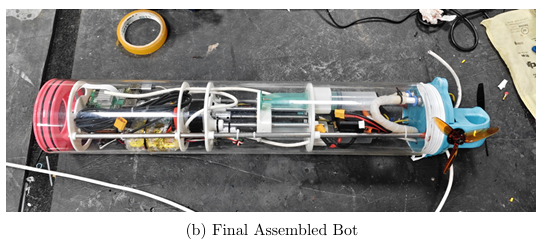
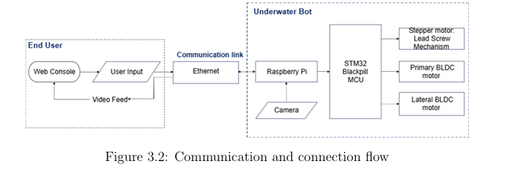
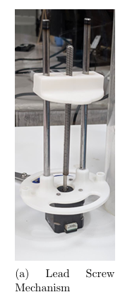
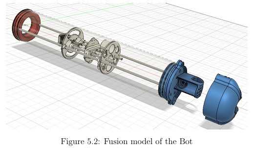

# Underwater Search & Rescue ROV

> **A tethered underwater robotic platform for search, visual inspection, and assisted recovery of submerged objects in low-visibility environments.**

An integrated prototype combining **mechanical design, embedded control, underwater propulsion, variable buoyancy, live video, and real-time computer vision**.

---

## Overview

Underwater search operations are difficult because visibility is strongly affected by turbidity, light absorption, and depth. This project develops a compact, modular ROV that moves the sensing and control hardware underwater while keeping the operator in the loop through a web interface.

The system uses a **Raspberry Pi 5** for high-level control, video and computer vision, and an **STM32F4 BlackPill** for real-time actuator control.



---

## Key Features

- **Tethered ROV architecture** for reliable operator control
- **Raspberry Pi 5** for high-level processing and communication
- **STM32F4** for real-time motor and actuator control
- **BLDC thrusters with ESCs** for underwater propulsion
- **Lead-screw based variable-buoyancy mechanism** for depth adjustment
- **On-board camera** for live underwater video
- **YOLOv8n-based detection pipeline**, converted to **NCNN** for lightweight inference
- **Web-based control interface** for operator commands and video monitoring
- Modular mechanical construction designed for iterative fabrication and testing

---

## System Architecture

The operator sends commands through the web interface. Commands are transmitted over the communication link to the Raspberry Pi, which coordinates the system and communicates with the STM32 controller. The STM32 generates the required actuator control signals for the propulsion and depth-control mechanisms.

```text
                    ┌─────────────────────┐
                    │      Operator       │
                    │    Web Interface    │
                    └──────────┬──────────┘
                               │
                         Communication
                               │
                    ┌──────────▼──────────┐
                    │    Raspberry Pi 5   │
                    │ Control + Video + ML │
                    └───────┬───────┬──────┘
                            │       │
                       Commands    Camera
                            │       │
                    ┌───────▼───────▼──────┐
                    │      STM32F4         │
                    │ Real-time Actuation  │
                    └───────┬──────────────┘
                            │
              ┌─────────────┼─────────────┐
              ▼             ▼             ▼
         BLDC Thrusters   BLDC Thruster  Lead Screw
```



---

## Mechanical Design

The mechanical system evolved through multiple design iterations, with the final concept integrating the electronics enclosure, propulsion system, camera, and depth-control mechanism within a compact cylindrical body.

The prototype uses an **acrylic cylindrical body approximately 60 cm long and 5 inches in diameter**, with custom 3D-printed structural components and end caps.

### Lead-Screw Depth Mechanism

A lead-screw mechanism is used to move the buoyancy-control assembly and provide controlled vertical movement.



### Final CAD Model

The final Fusion 360 assembly integrates the major mechanical subsystems into a single platform.



---

## Electronics & Embedded Control

The control architecture is divided between two processing layers:

| Layer | Hardware | Role |
|---|---|---|
| High-level | Raspberry Pi 5 | Communication, camera, web interface and ML inference |
| Real-time | STM32F4 BlackPill | Motor/actuator control and timing-critical operations |
| Propulsion | BLDC + ESC | Underwater thrust |
| Depth control | Stepper motor + lead screw | Buoyancy/depth adjustment |
| Vision | Camera | Live underwater video and detection |

This separation keeps computationally intensive vision tasks away from the real-time actuator-control loop.

---

## Computer Vision

The camera feed is processed using a lightweight object-detection pipeline.

**Pipeline:**

```text
Camera
   │
   ▼
Live Video
   │
   ▼
YOLOv8n
   │
   ▼
NCNN Runtime
   │
   ▼
Detection Output
   │
   ▼
Web Interface
```

The model was converted to an **NCNN-compatible format** to make inference practical on the Raspberry Pi platform. The implemented pipeline achieves approximately **12 FPS** under the tested configuration.

The vision system is intended as an **operator-assistance layer** rather than a replacement for human verification.

---

## Software

### Raspberry Pi

The Raspberry Pi software provides:

- Web-based operator interface
- Motor/control command handling
- Camera streaming
- Computer-vision inference
- Communication with the STM32

### STM32

The STM32 firmware is developed using **STM32CubeIDE** and handles the low-level actuator interface, including PWM-based motor control and stepper-motor operation.

---

## Repository Structure

```text
Underwater_ROV/
├── mechanical/
│   ├── iteration_1/
│   ├── iteration_2/
│   └── README.md
├── schematics/
│   ├── schematics_and_components.pdf
│   ├── hand_drawn_electrical_wiring.png
│   ├── overall_system_connection_diagram.png
│   └── communication_connection_flow.png
├── firmware/
│   └── stm32/
├── software/
│   └── raspberry_pi/
├── scripts/
├── README.md
├── LICENSE
└── CHANGELOG.md
```

---

## Current Status

**Prototype stage**

- Mechanical platform assembled
- Embedded control architecture integrated
- Raspberry Pi software implemented
- STM32 firmware implemented
- Camera and web interface integrated
- Lightweight detection pipeline integrated
- Controlled prototype testing completed

Further work is required for robust end-to-end underwater deployment, particularly long-duration operation, thermal management, sealing, and extended field testing.

---

## Future Work

- Improve waterproofing and sealing reliability
- Extend operating time through improved thermal and power management
- Perform complete underwater end-to-end testing
- Improve the operator interface for different display sizes
- Investigate extended communication using a floating Wi-Fi relay
- Improve detection robustness under varying underwater visibility

---

## Technology Stack

**Embedded:** STM32F4 · STM32CubeIDE · C · PWM · GPIO  
**Compute:** Raspberry Pi 5 · Python · NCNN  
**Vision:** YOLOv8n · OpenCV · Camera  
**Mechanical:** Fusion 360 · 3D Printing · Acrylic enclosure  
**Propulsion:** BLDC motors · ESCs · Stepper motor  
**Interface:** Web UI · Ethernet/communication link

---

## Project Context

This project was developed as a **B.Tech project in Electrical Engineering at IIT Indore**, with emphasis on integrating mechanical, embedded, electronics, and computer-vision subsystems into a single underwater robotic platform.

---

## License

See [`LICENSE`](LICENSE) for the project license.
